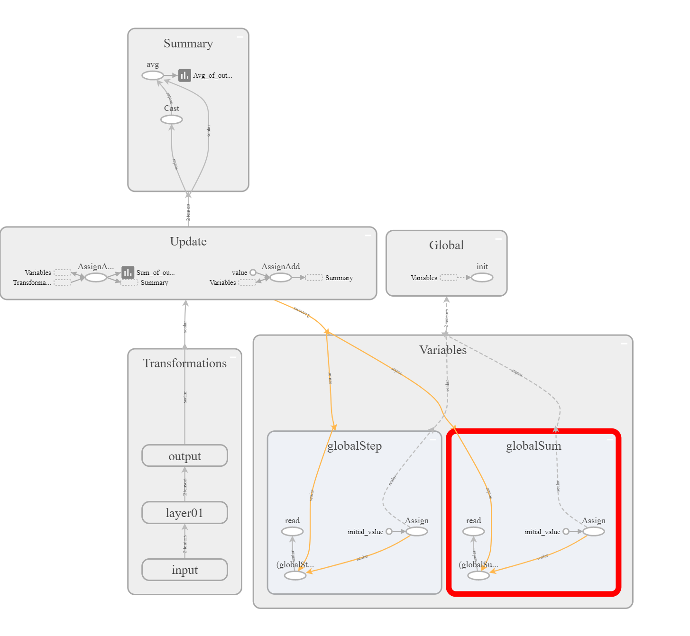

# TENSORFLOW-STUDY
> 2017-10-24

In this repository I try to learn [tensorflow](https://www.tensorflow.org/) step by step.

Each chapter has `boss.py` file , which is a comprehensive exercise in this chapter.

**version information**

item|version|remark
------|------|------
OS|windows 8.1| 64 bit
python|3.6.2|
tensorflow|1.3.0|`CPU` only
tensorflow-tensorboard|0.1.6|

## chapter01:hello

This chapter is mainly familiar with [tensorflow](https://www.tensorflow.org/) components and learn how to use them.

- [x] Tensor
- [x] Operation
- [x] Graph
- [x] Session

Normally, we can see a graph like below after running `boss.py` script file

