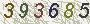

# 验证码识别
> add on 2018年5月23日

# 概述

验证码格式如下：

* 6 位纯数字
* 6 位数字+大写字母

**示例**



## 准备数据

纯数字10W张验证码下载：<https://pan.baidu.com/s/1ABq7Px9bcpLnFQgpEOApnQ>

存放路径为 `G:/captcha`

**注意**

* 原始数据在训练前需要进行标准化处理，常用的方案：

```python
# 标准化处理，x 为 numpy 数组
def standardize(x):
	return (x - x.mean()) / s.std()
```

# 训练

先介绍一下数据的输入输出

**输入**

图片 w*h 大小为 `90*24`，RGB 通道

**输出**

* 纯数字验证码 shape = [-1, 60]
* 纯字母验证码（大小写） shape = [-1, 312]

## 纯数字识别模型

### 全连接神经网络
> 这里采用的是 2 层（包含一个 1024 节点的隐藏层）全连接 NN

```python
# 构建模型
def build_model():
    input_x = tf.layers.flatten(X)
    w1 = tf.Variable(tf.random_uniform([Config.NN_IN_SIZE, Config.NN_NODE]))
    b1 = tf.Variable(tf.random_uniform([Config.NN_NODE]))
    layer1 = tf.nn.dropout(tf.add(tf.matmul(input_x, w1), b1), keep_prob=keep_prob)

    w2 = tf.Variable(tf.random_uniform([Config.NN_NODE, Config.NN_OUT_SIZE]))
    b2 = tf.Variable(tf.random_uniform([Config.NN_OUT_SIZE]))
    layer2 = tf.nn.dropout(tf.add(tf.matmul(layer1, w2), b2), keep_prob=keep_prob)

    return layer2

# 或者使用 tf.layers.dense快捷创建模型
def build_model_dense():
    """
    使用 tf.layers 搭建全连接前向传播模型
    :return:
    """
    input_x = tf.layers.flatten(X)

    y = tf.layers.dense(input_x, Config.NN_NODE, kernel_initializer=tf.initializers.random_uniform)
    y = tf.layers.dropout(y, rate=Config.NN_KEEP_PROB)
    y = tf.layers.dense(y, Config.NN_OUT_SIZE)

    return y
```

## 优化器及

```python
def build_train(y_pred):
    # 损失函数
    loss_ = tf.reduce_mean(tf.nn.sigmoid_cross_entropy_with_logits(labels=Y, logits=y_pred))

    train_op = tf.train.RMSPropOptimizer(Config.NN_LEARNING_RATE).minimize(loss_, global_step)

    # 计算准确率
    # 1. 先进行切分  [60] => [6, 10]
    y_pred_reshape = tf.reshape(y_pred, [-1, Config.CHAR_LEN])
    y_reshape = tf.reshape(Y, [-1, Config.CHAR_LEN])
    # 2. 计算
    max_index_pred = tf.argmax(y_pred_reshape, axis=1)
    max_index = tf.argmax(y_reshape, axis=1)
    max_index_pred = tf.reshape(max_index_pred, [-1, Config.CAPTCHA_LEN])
    max_index = tf.reshape(max_index, [-1, Config.CAPTCHA_LEN])
    fn = lambda x: tf.equal(tf.reduce_mean(tf.cast(x, tf.float32)), 1.)
    is_correct = tf.map_fn(fn, tf.equal(max_index_pred, max_index))
    accuracy = tf.reduce_mean(tf.cast(is_correct, tf.float32))

    return loss_, train_op, accuracy
```
